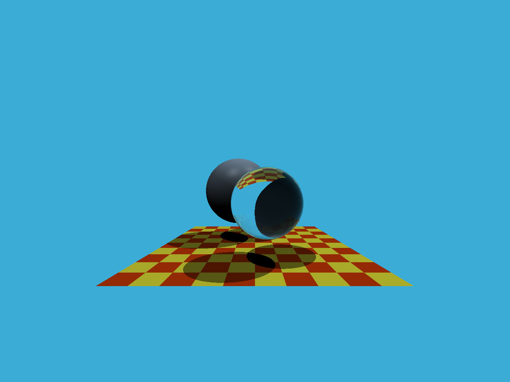
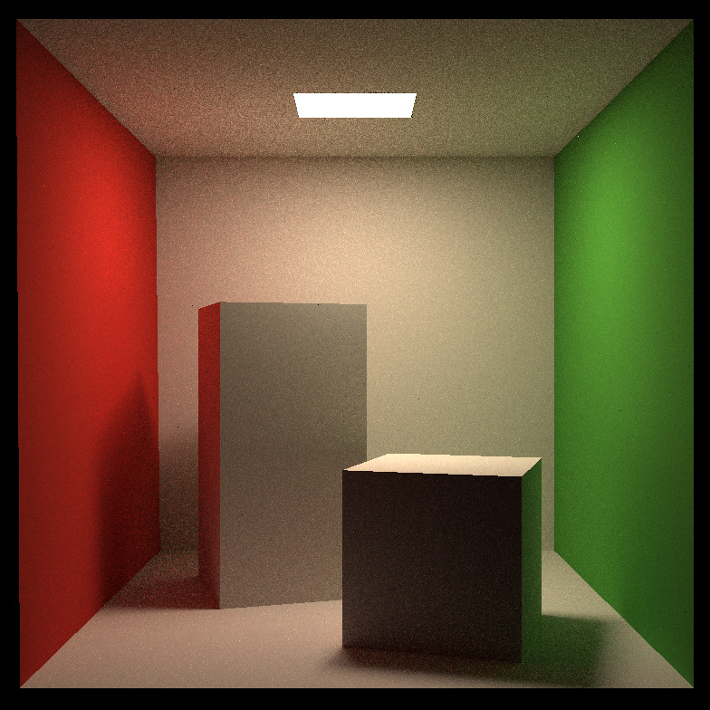

# Games101 Renderer

This project is based on Games 101 assignment 5 and assignment 7, where I implemented two ray tracing algorithms including traditional witted-style ray tracing and modern path tracing. 

## Witted-Style Ray Tracing

In this part, Moller Trumbore algorithm is applied to compute the intersection of ray with the triangles.

## Path Tracing

The traditional witted-style ray tracing has many false assumptions leading to some unreal effects. Path tracing applied the rendering equation and physical based material to achieve a more realistic rendering image. In this part, I implemented the path tracing algorithm with Monte Carlo Integration.

